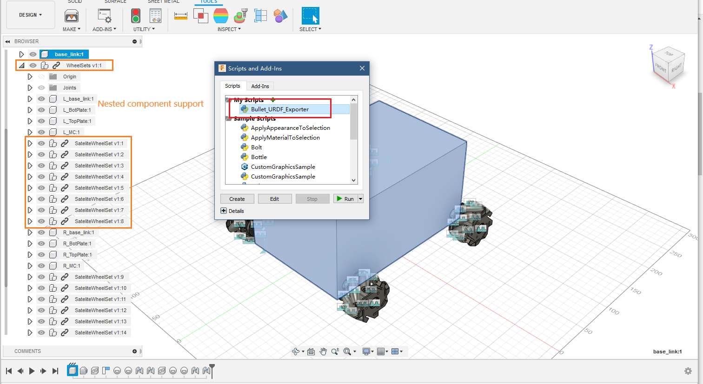
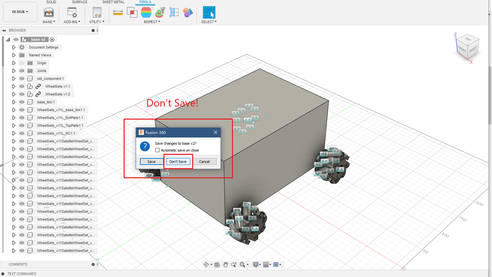

# Fusion2Pybullet

Developed from [@syuntoku14/fusion2urdf](https://github.com/syuntoku14/fusion2urdf). 

### What is this script?

A Fusion 360 script to export urdf files. This is a PyBullet adpative version. 

**03/25/2020 BETA: Supporting exportation of  simple nested components.**

03/27 update: Add "Do not Capture Design History" to fix InternalValidationError. See https://github.com/yanshil/Fusion2Pyblluet/wiki/Developer-Notes

03/27 update2: Add a supplementary script **Joint2Graphviz** to check assembled structures.

This exports:

* .urdf files of the model
* .stl files of your model
* A example hello.py to load your model into PyBullet.

### Fusion Add-in
Add this script into Fusion 360 via Tools -> Add-Ins




#### Before using this script

1. Some other notes for getting avoid of warnings: 
   1. Change language preference to English
   2. Rename any full-width symbol to half-width symbol (like `。` and `（）`)
2. Set up `base_link`

#### Using script inside Fusion 360: Example

1. Set up the components properly

- [x] A base_link

- [x] Check component and joint names (Set English as the language if necessary)

- [x] **IMPORTANT! Set up joints properly** 

	* Supplementary script: **Joint2Graphviz** will generate a txt file capable for Graphviz. Copy the content to http://www.webgraphviz.com/ to check the graph. Usually a correct model should be a DAG with 'base_link' as the root.
	
	* In fusion, when you hit 'J' to assemble joints, note that the exporter consider **component 1 as 'child' and component 2 as 'parent'**. For example, when you want to assemble a 4-wheel car with middle cuboid as `base_link`, you should assemble the vehicle with wheel as component 1 and 'base_link' as component 2.

	* For example, you should be assemble your model to make result of `check_urdf simple_car.urdf`  like the following. i.e. BL, BR, FL, FR as component 1 and base_link as component 2 when you assemble these 4 joints.
	```
    robot name is: simple_car
	  ---------- Successfully Parsed XML ---------------
	  root Link: base_link has 4 child(ren)
	      child(1):  BL_1
	      child(2):  BR_1
	      child(3):  FL_1
	      child(4):  FR_1
	```

2. Run the script and select storing location
   * Note: **Don't save** your file after running the scripts! DesignType will be set to "Direct Mode" and some temporary components will be created. That's not the changes you want!
   * 
   * 
   * 
   
3. Enjoy from `python hello_bullet.py` !


###  Important: what to do when error pops out?

* Bugs are usually  caused by wrongly set up joints relationships
* Nest-component support might also lead to undocumented bugs. So remove the nesting structure helps a lot.

Since the script still cannot showing warnings and errors elegantly, if you cannot figure out what went wrong with the model while bugs are usually  caused by wrongly set up joints relationships, you can do the following things:

1. Make sure every joints are set up correct (parent and child relationship). If failed ---> 
2. Re-tidy your design to make it not include any nest-components. Use this script. If failed --->  
3. Try the stable version https://github.com/yanshil/Fusion2Pyblluet/tree/stable.


### Joint2Graphviz
* Sometimes you need to set "Do not capture design history" before running the script.
* Copy the content of the generated "graph.txt" and go to http://www.webgraphviz.com/
* Example: One of the wrongly assembled mecanum wheel gives

```
digraph G {  "R_BotPlate1" -> "R_MiddleCylinder1"
  "R_MiddleCylinder1" -> "R_TopPlate1"
  "R_TopPlate1" -> "base_link1"
  "R_TopPlate1" -> "Wheel_set1Roller1"
  "R_TopPlate1" -> "Wheel_set2Roller1"
  "R_TopPlate1" -> "Wheel_set3Roller1"
  "R_TopPlate1" -> "Wheel_set4Roller1"
  "R_TopPlate1" -> "Wheel_set6Roller1"
  "R_TopPlate1" -> "Wheel_set7Roller1"
  "R_TopPlate1" -> "Wheel_set8Roller1"
  "R_TopPlate1" -> "Wheel_set5Roller1"
  "Wheel_set1Roller1" -> "Wheel_set1Satellite_Wheel1"
  "Wheel_set2Roller1" -> "Wheel_set2Satellite_Wheel1"
  "Wheel_set3Roller1" -> "Wheel_set3Satellite_Wheel1"
  "Wheel_set4Roller1" -> "Wheel_set4Satellite_Wheel1"
  "Wheel_set5Roller1" -> "Wheel_set5Satellite_Wheel1"
  "Wheel_set6Roller1" -> "Wheel_set6Satellite_Wheel1"
  "Wheel_set7Roller1" -> "Wheel_set7Satellite_Wheel1"
  "Wheel_set8Roller1" -> "Wheel_set8Satellite_Wheel1"
}
```

 Click Generate Graph and I get 


Here I can find out 

1.  "base_link" is wrongly set as topplate's child
2. R_MiddleCylinder should be TopPlate's child but it's set as parent
3. R_BotPlate should be R_MiddleCylinder's child but it's set as parent.